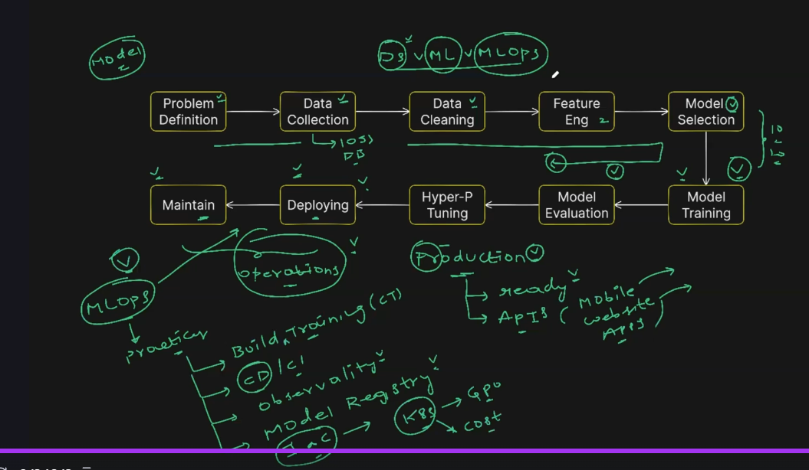

# Data Scientist vs ML Engineer vs MLOps Engineer

### Data Scientist – The “Brain Behind the Model”

What they do:

Understand the business problem

Explore datasets

Clean and preprocess data

Try different algorithms

Build and evaluate ML models

Present insights to stakeholders

Think of them as:
Researchers + Statisticians + Storytellers
They turn raw data into a working ML model on a laptop or notebook environment.

Not their job:

Deployment

Scalability

Monitoring

CI/CD

Cloud infrastructure

### ML Engineer – The “Builder Who Converts Model Into a Real Product”

What they do:

Take the model created by the Data Scientist

Convert it into production-ready code

Optimize it for performance (latency, throughput, memory)

Build APIs around the model

Integrate with backend systems

Think of them as:
Software engineers who specialize in ML models
They ensure the model works efficiently in an application or service.

Not their job:

Managing training pipelines

CI/CD for ML

ML monitoring at scale

Model governance

### MLOps Engineer – The “DevOps for Machine Learning”

What they do:

Build reproducible training pipelines

Automate data ingestion and feature engineering

Manage experiment tracking

Set up model registry

Deploy models with CI/CD

Monitor models in production (drift, accuracy, latency)

Manage infra – Kubernetes, GPUs, cloud, scaling

Enable teams (Data Scientists + ML Engineers) to ship models faster and safely

Think of them as:
DevOps + Cloud + ML workflow automation
They ensure ML systems keep running reliably, just like DevOps ensures apps run reliably.

Not typically their job:

Doing heavy data analysis

Designing new ML algorithms

Creating the first version of the model

In One Simple Line

Data Scientist: Creates the model.

ML Engineer: Turns the model into production code.

MLOps Engineer: Builds the system that trains, deploys, scales, and monitors the model.